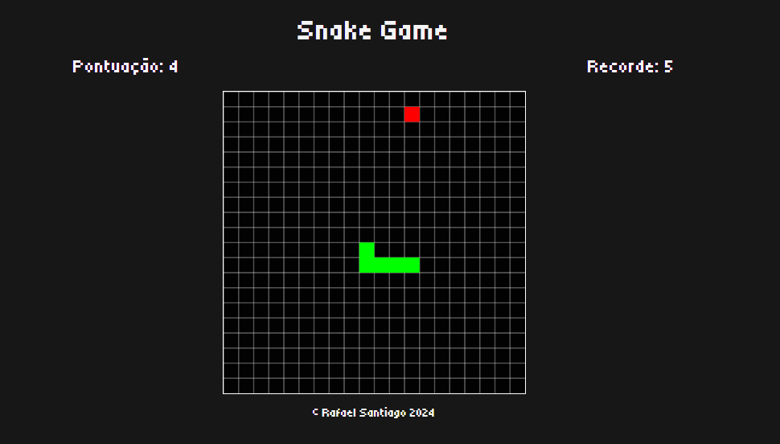

<h1>Snake Game🐍🍎</h1>

Consite no clássico jogo da cobrinha. Conforme você come a maçã, a cobra cresce. Há sistema funcional de recorde também!

Jogue aqui: [https://rafaelsantiagosilva.github.io/snake_game/](https://rafaelsantiagosilva.github.io/snake_game/)

## Tecnologias usadas

# Funcionalidades

O projeto foi feito com base em um desafio de grupo de networking. Pode se visualizar as exigências [aqui](TODO.md)!